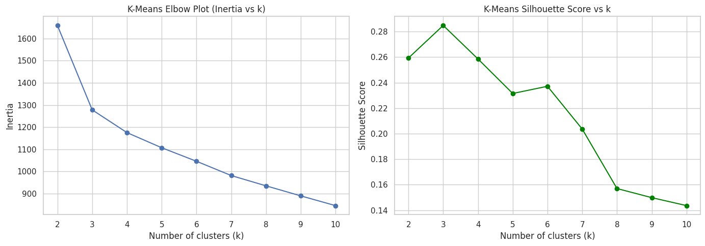
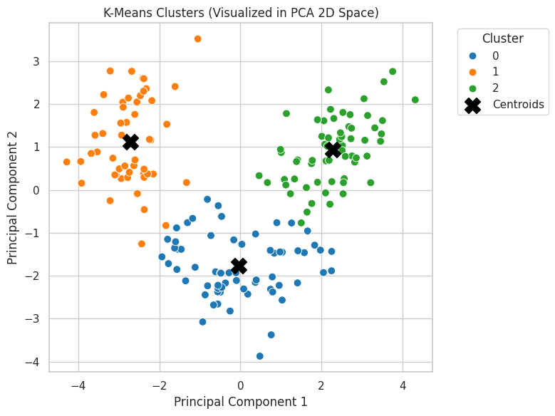
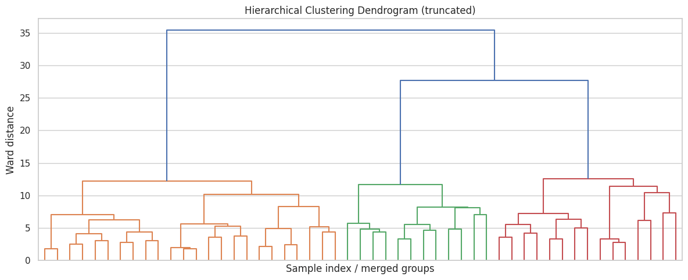
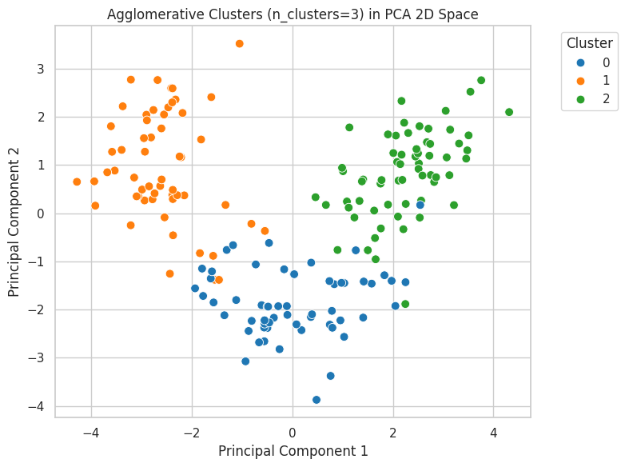
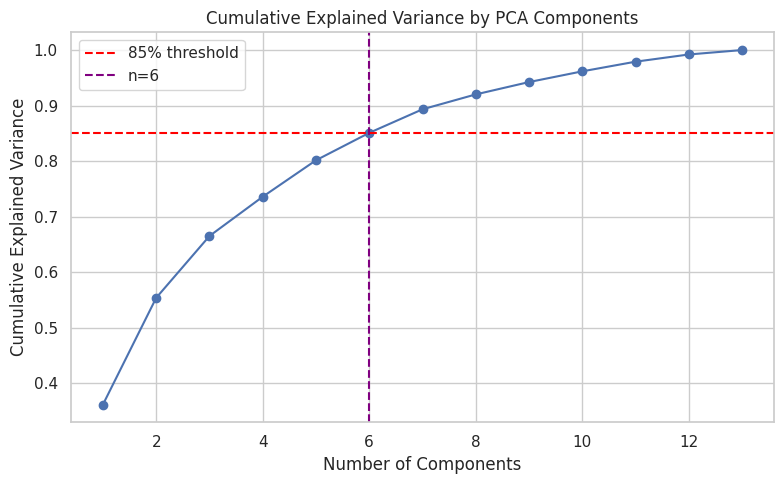
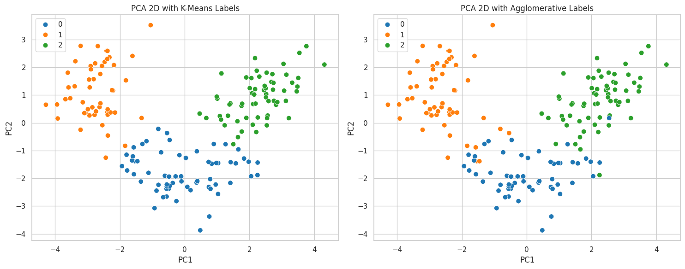
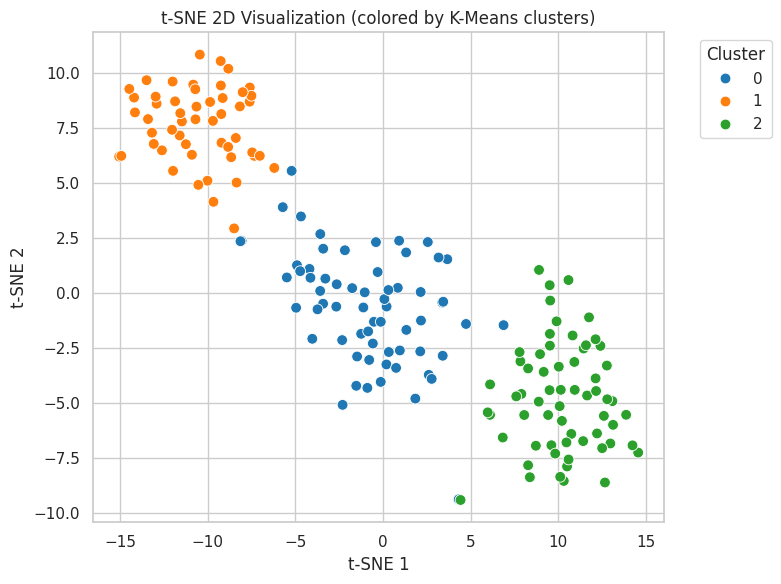

# Part 2: Unsupervised Learning Activity Report

**Group Members:** Ahammad Jony, Kumara Muditha, Podkorytov Nikolai, Shrestha Bata Prabesh

## 1. Problem Statement and Dataset Choice
The objective of this activity is to explore the natural groupings within a multi-dimensional dataset without the use of pre-defined labels. We chose the **Wine Dataset** from the `scikit-learn` library. This dataset contains the results of a chemical analysis of wines grown in the same region in Italy but derived from three different cultivars. It includes 13 numerical features such as Alcohol, Malic Acid, Ash, and Magnesium.

**Why this dataset?**
* It is a high-quality, reliable dataset available locally.
* The multiple numerical features provide a complex space for testing distance-based clustering.
* It allows us to evaluate how well unsupervised models can recover underlying structures (cultivars) without being shown the labels during training.

## 2. Technical Implementation and Observations

### 2.1 Data Preprocessing
Before applying any models, the data was standardized using `StandardScaler`. This ensures that features with larger numerical ranges (like Magnesium) do not disproportionately influence the distance calculations compared to features with smaller ranges (like Phenols).

### 2.2 Model 1: K-Means Clustering
We implemented K-Means to partition the data into $k$ clusters. To determine the optimal number of clusters, we utilized the **Elbow Method**.

* **Observation:** The "elbow" in the inertia plot indicated that $k=3$ is the most efficient number of clusters for this dataset.

### 2.3 Model 2: Hierarchical (Agglomerative) Clustering
As a comparative model, we used Agglomerative Clustering. This bottom-up approach was visualized using a **Dendrogram** to understand the hierarchy of merges.

* **Observation:** The dendrogram successfully illustrated the distances between clusters, further supporting the choice of 3 main groupings.

### 2.4 Dimensionality Reduction: PCA
To visualize our 13-dimensional data in a 2D space, we applied **Principal Component Analysis (PCA)**. We reduced the feature set to two principal components.

* **Observation:** The PCA scatter plot clearly shows three distinct clusters with minimal overlap, suggesting that the chemical properties of the wine are strong indicators of their origin.

### 2.5 Optional: t-SNE for Non-Linear Structure

## 3. Comparative Analysis and Metrics
We evaluated the performance of both models using the following metrics:

| Metric | K-Means Result | Hierarchical Result |
| :--- | :--- | :--- |
| **Silhouette Score** | *(Insert value from notebook)* | *(Insert value from notebook)* |
| **Davies-Bouldin Index** | *(Insert value from notebook)* | *(Insert value from notebook)* |

**Insights:**
* The **Silhouette Score** (closer to 1 is better) indicates how well-separated the clusters are.
* The **Davies-Bouldin Index** (lower is better) measures the average similarity between each cluster and its most similar one.
* **Conclusion:** Both models performed similarly, but K-Means showed slightly more compact clusters based on the specific metrics observed in the notebook.

## 4. Ethical and Practical Considerations

### 4.1 Potential Risks
1.  **Bias:** If the training data is skewed (e.g., only including wines from one specific vineyard), the model will produce clusters that are not representative of global wine varieties.
2.  **Privacy:** While not applicable to wine, in a consumer context (like the Mall Customer dataset), clustering can lead to sensitive profiling or the "re-identification" of anonymous individuals through behavioral patterns.
3.  **Misinterpretation:** In unsupervised learning, the model finds patterns but does not know "why" they exist. Humans might assign incorrect meanings to these clusters, leading to flawed business decisions.

### 4.2 Mitigation Strategies
* **Anonymization:** Ensure all personally identifiable information (PII) is removed before clustering.
* **Transparency:** Always report the limitations and assumptions made during the modeling process.
* **Human-in-the-Loop:** Use domain experts to validate the practical meaning of the clusters generated by the algorithm.

## 5. Key Takeaways
Our group found that PCA is an indispensable tool for interpreting high-dimensional data. Without it, we could not have visually confirmed the success of our clustering models. Furthermore, we learned that while K-Means is faster, Hierarchical clustering provides a much richer view of how data points relate to one another through the dendrogram.

## 6. Repository and Commit Reference
- Repository Link: https://github.com/Muditha-Kumara/Applied-artificial-intelligence/tree/main/2.1
- Commits Link: https://github.com/Muditha-Kumara/Applied-artificial-intelligence/commits/main/2.1