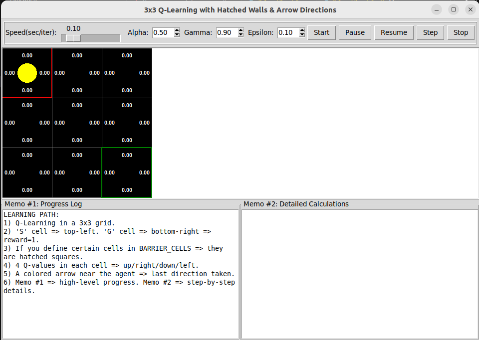
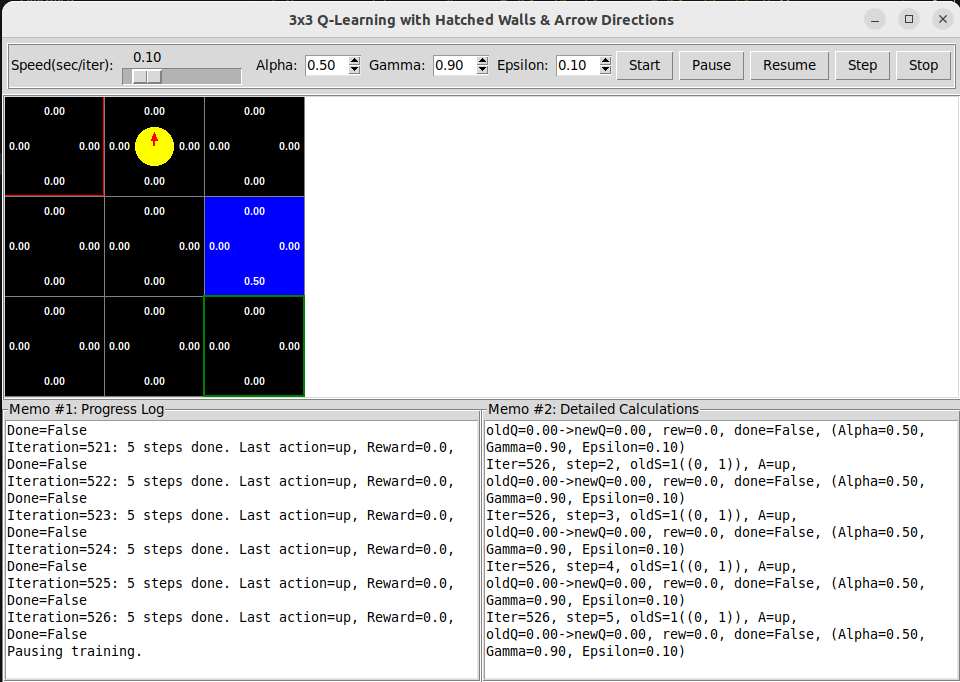
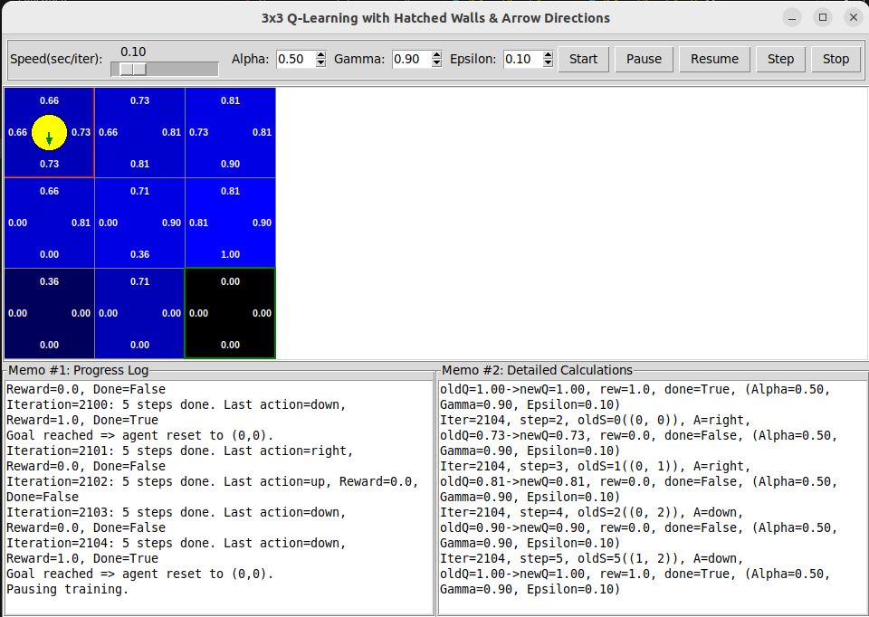
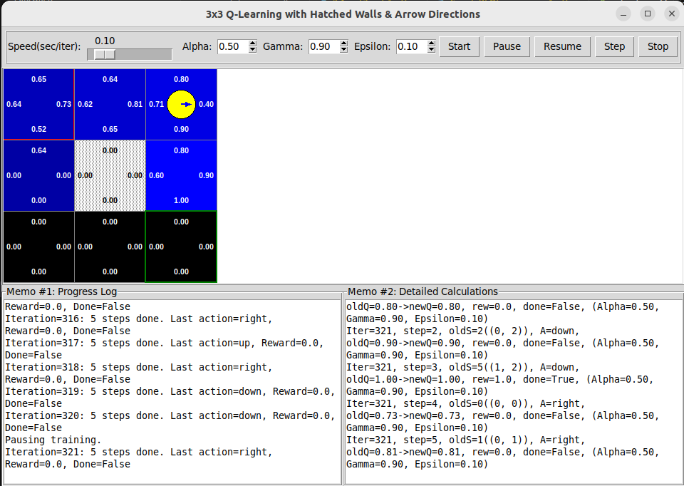

## Part 3: Reinforcement Learning Activity – Q-Learning Exploration Report

In this section, We are documents the exploration and analysis of the provided tabular Q-learning agent.

---

### 1. Environment Modifications
The initial environment was a $3 \times 3$ grid where the agent starts at $(0,0)$ and the goal is located at $(2,2)$ with a reward of **1.0**.

* **Grid Layout:** We utilized the default $3 \times 3$ matrix (States 0-8).
* **Obstacles:** We experimented by defining `BARRIER_CELLS = {(1,1)}` in the code to observe how the agent navigates around a central hatched wall.
* **Goal Placement:** The goal remained at the bottom-right to maximize the path distance from the start, providing a clear visualization of policy convergence.

### 2. Hyperparameter Experimentation
We tested various configurations using the GUI spinboxes to observe impacts on learning efficiency:

| Parameter | Tested Value | Observed Effect |
| :--- | :--- | :--- |
| **Alpha ($\alpha$)** | 0.1 vs 0.8 | At **0.8**, the Q-values updated rapidly but fluctuated; at **0.1**, learning was stable. But it wasvery slow. |
| **Gamma ($\gamma$)** | 0.5 vs 0.95 | At **0.95**, the agent "valued" the goal more from a distance, creating a stronger gradient of blue in the heatmap. |
| **Epsilon ($\epsilon$)** | 0.05 vs 0.5 | At **0.5**, the agent moved randomly frequently; at **0.05**, it followed the "learned" arrows almost exclusively. |

### 3. Observations of Agent Behavior
* **Initial Attempts:** In early iterations, the agent's movement was erratic (random exploration), and all Q-values remained near **0.00**.
* **Q-Table Evolution:** As the agent hit the goal, the Q-values for actions leading to $(2,2)$ increased. This "reward signal" back-propagated toward the start state $(0,0)$ over multiple episodes.
* **Path Efficiency:** Once the Q-values stabilized, the agent consistently chose the shortest path (e.g., Right $\rightarrow$ Right $\rightarrow$ Down $\rightarrow$ Down), indicated by the bold blue arrows in the GUI.

### 4. Reflection and Analysis
* **Adaptation:** The agent adapts by updating its Q-table based on the temporal difference error, essentially "remembering" which state-action pairs lead to the $+1.0$ reward.
* **Challenges:** A key challenge in RL is **scalability**; while a $3 \times 3$ grid (9 states) is solved in seconds, a real-world environment with millions of states would require Deep Q-Learning rather than a table.

### 5. Ethical and Practical Considerations
* **Reward Hacking:** If we accidentally gave a small reward for "moving," the agent can loop in circles to collect rewards without ever reaching goal.
* **Safety:** In a real-world robotics scenario, a high **Epsilon ($\epsilon$)** (exploration) could cause the agent to take a "random" dangerous action, highlighting the need for "Safe RL" constraints.

---

### Required Screenshots for Attachment

1.  **Initial State:** A screenshot of the GUI at **Iteration 0** with all Q-values at $0.00$ and the agent at $(0,0)$.

2.  **Mid-Training Progress:** A screenshot showing the **Detailed Calculations (Memo #2)** where a $Q$-value is updated from $0.00$ to a positive number.

3.  **Converged Policy:** A screenshot of the fully trained $3 \times 3$ grid where the cells are **dark blue** near the goal and the action arrows clearly point toward the bottom-right.

4.  **Barrier Navigation:** A screenshot showing the agent moving around the **hatched gray cell** (if $(1,1)$ was set as a barrier).

---

### Group Key Takeaways
Our group observed that the **Discount Factor ($\gamma$)** is critical for long-term planning. Without a high $\gamma$, the agent struggles to "see" the value of the goal when it is several steps away. We also realized that RL success is highly dependent on the balance between exploration and exploitation.
