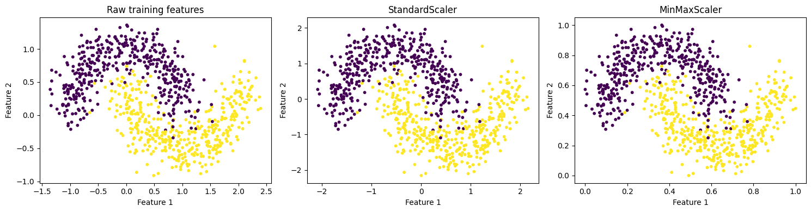
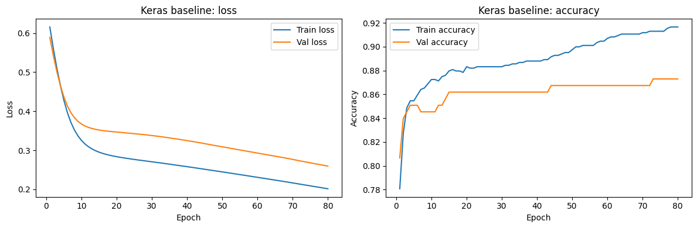
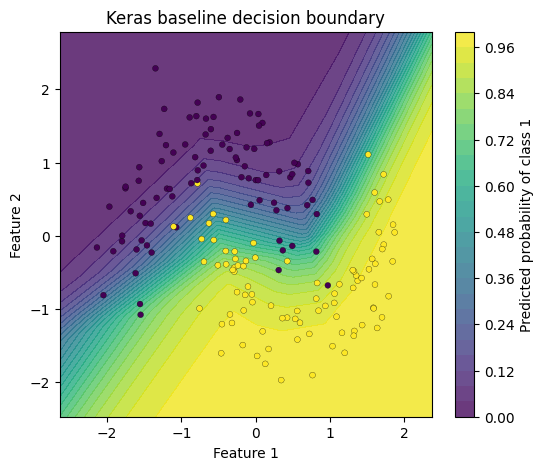

# Assignment 3.2: Part 0 - Tutorial Exploration & Reflection Report

**Group Members:**
* Ahammad, Jony
* Kumara, Muditha
* Podkorytov, Nikolai
* Shrestha Bata, Prabesh

---

## 1. Summary of Learned
**Deep learning frameworks** are specialized software libraries that provide the building blocks for creating, training, and deploying neural networks efficiently. They are useful because they handle complex mathematical operations (like backpropagation) automatically.

* **TensorFlow/Keras:** A high-level, user-friendly API (Keras) running on top of TensorFlow, often preferred for rapid prototyping and ease of use.
* **PyTorch:** A framework known for its flexibility and dynamic computational graphs, widely used in research and for complex model debugging.

**Key Stages of a Deep Learning Workflow:**
* **Data Preparation:** Cleaning and formatting data so the model can process it.
* **Model Definition:** Designing the architecture (layers) of the neural network.
* **Training:** Feeding data through the network to update its internal weights.
* **Evaluation:** Testing the model on unseen data to check its accuracy.
* **Visualization:** Creating plots to understand model performance.

---

## 2. Key Concepts from the Notebook

| Concept | What it does | Impact on Training | Too Large vs. Too Small |
| :--- | :--- | :--- | :--- |
| **Hidden Layers** | Layers between input and output that extract features. | Increases model capacity to learn complex patterns. | Too many can lead to overfitting; too few may underfit. |
| **Activation Functions** | Adds non-linearity to the network (e.g., ReLU, Sigmoid). | Allows the network to learn non-linear relationships. | Wrong choice can cause "vanishing gradients." |
| **Loss Functions** | Measures the "error" between predictions and actual labels. | Guides the optimizer on how to adjust weights. | N/A (must match the specific task type). |
| **Optimizers** | Algorithms (e.g., Adam, SGD) that update model weights. | Determines how quickly/smoothly the model converges. | Affects stability and training speed. |
| **Learning Rate** | Controls the size of the steps taken during optimization. | Most critical hyperparameter for convergence. | Too large: Divergence; Too small: Training takes forever. |
| **Batch Size** | Number of samples processed before updating weights. | Affects memory usage and gradient stability. | Too large: High memory use; Too small: Noisy updates. |
| **Epochs** | One full pass through the entire dataset. | More epochs allow for more learning. | Too many: Overfitting; Too few: Underfitting. |
| **Dropout** | Randomly deactivates neurons during training. | Acts as regularization to prevent overfitting. | Too high: Network can't learn; Too low: No effect. |

---

## 3. Comparison of Frameworks
Based on our observation of the [`DL_frameworks_tutorial.ipynb`](https://github.com/Muditha-Kumara/Applied-artificial-intelligence/blob/main/3.2/DL_frameworks_tutorial.ipynb):
1.  **Code Structure:** TensorFlow/Keras often uses a "Sequential" or "Functional" API which is very concise, while PyTorch typically uses class-based structures.
2.  **Training Loop:** In Keras, training is often a simple `.fit()` call; in PyTorch, we manually write the steps for the forward pass, loss calculation, and backpropagation.
3.  **Flexibility/Debugging:** PyTorch feels more like standard Python, making it easier to step through and debug code compared to TensorFlow’s static-style graphs.

---

## 4. Screenshots and Observations

* **Dataset Visualization:** 

* **Training Curves:** 

* **Decision Boundary:** 

---

## 5. Additional Research

* **Source 1: [PyTorch Official Documentation - torch.compile()](https://pytorch.org/docs/stable/generated/torch.compile.html)** * **Summary:** We researched one of the most significant recent updates to PyTorch: the introduction of `torch.compile()`. This feature allows PyTorch to move beyond its traditional interpreted execution by using a compiler to optimize the model’s computational graph. We learned that this "one-line" optimization can provide substantial speedups (20%+) in training time while maintaining the flexible, Pythonic debugging experience that makes PyTorch a favorite for research.

* **Source 2: [Keras 3: Multi-backend Deep Learning](https://keras.io/keras_3/)** * **Summary:** To understand the future of the TensorFlow ecosystem, we explored Keras 3. We discovered that Keras has evolved from being just a TensorFlow API to a multi-backend framework that can run on top of TensorFlow, PyTorch, or JAX. This research highlighted a critical shift in the industry: rather than choosing one framework, developers can now write code once in Keras and switch backends to leverage specific strengths, such as TensorFlow’s superior production deployment or PyTorch’s rapid prototyping.

* **Source 3: [TensorFlow TFX & MLOps Best Practices](https://www.tensorflow.org/tfx/guide)** * **Summary:** While the tutorial focused on model building, our additional research into TensorFlow Extended (TFX) showed how TensorFlow dominates the enterprise "production" space. We learned about the importance of end-to-end pipelines, including data validation, model analysis, and serving at scale. This helped us realize that while PyTorch is highly intuitive for experimentation, TensorFlow’s infrastructure (like TF Serving) is often the preferred choice for industrial-grade applications requiring high stability and monitoring.

---

## 6. Individual Reflections

* **Kumara, Muditha:** The note book is clear and understandable. It is very user freindly and easy to do many reseach and comparizon. ""Leaky ReLU" dose not implement default. Just one data set, difficult to understand effect of "sgd", "adam" and "rmsprop". Also need do further testing with "learning_rate" with different kind of data sets. Monitor both models Kera and PyTorch show same purformance. 
* **Member 2:** ...
* **Member 3:** ...
* **Member 4:** ...