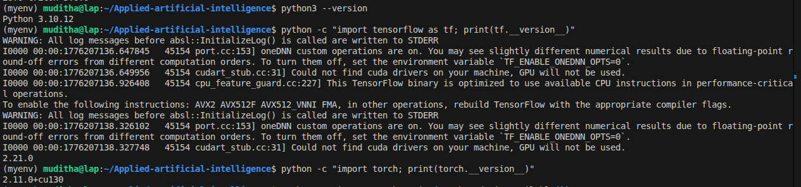
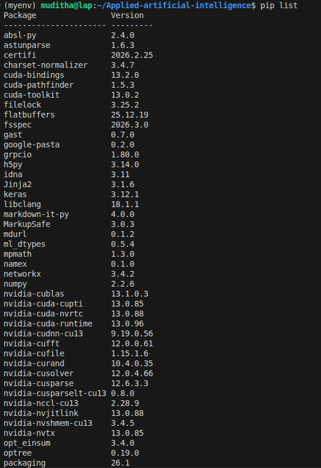
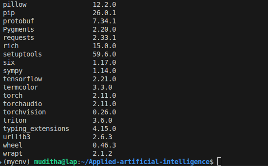
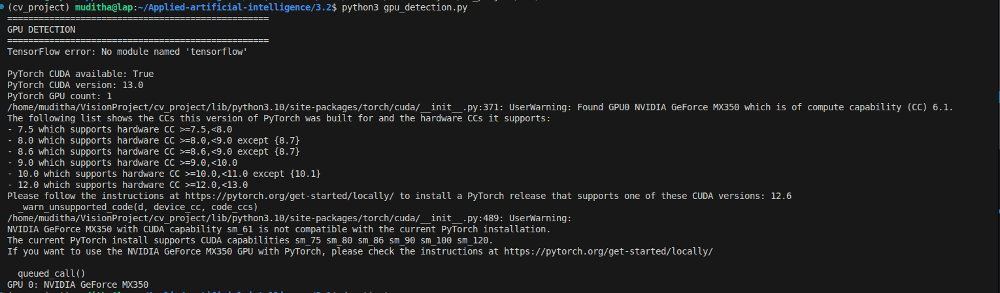
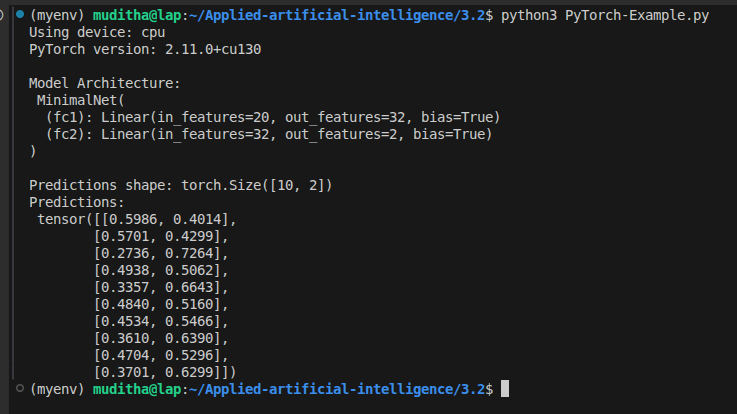
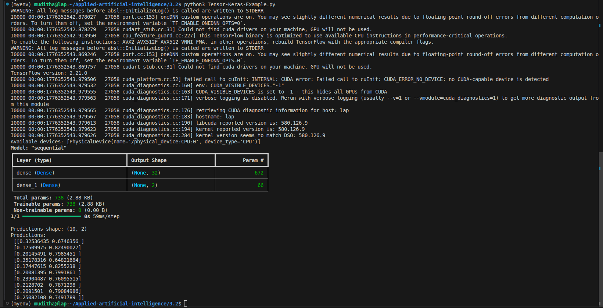

# Part 1: Environment Setup & Mini Project

## Group Members
- Ahammad, Jony
- Kumara, Muditha
- Podkorytov, Nikolai
- Shrestha Bata, Prabesh

---

## 1. Framework Choice & Installation

### Which Framework Was Selected
**Framework:** TensorFlow and PyTorch both

### Installation Method
**Method Used:** pip

**Commands Executed:**
```bash
pip install tensorflow
pip install torch torchvision
```

**Installation Status:** ✅ Successful



---

## 2. Virtual Environment Setup

### Environment Configuration
**Virtual Environment Tool:** venv

**Setup Commands:**
```bash
python3 -m venv myenv
source myenv/bin/activate
```


### Environment Details
- **Python Version:** 3.10.12
- **Framework Version:** TensorFlow 2.21.0, PyTorch 2.11.0+cu130


- **Dependencies Installed:**





---

## 3. GPU Verification & Configuration

### GPU Detection Code

```python
"""GPU detection script for TensorFlow and PyTorch."""

def check_tensorflow_gpu():
    try:
        import tensorflow as tf

        gpus = tf.config.list_physical_devices('GPU')
        print('TensorFlow GPUs:', gpus)
        print('TensorFlow GPU count:', len(gpus))
    except Exception as e:
        print('TensorFlow error:', e)


def check_pytorch_gpu():
    try:
        import torch

        print('PyTorch CUDA available:', torch.cuda.is_available())
        print('PyTorch CUDA version:', torch.version.cuda)
        print('PyTorch GPU count:', torch.cuda.device_count())

        if torch.cuda.is_available():
            for i in range(torch.cuda.device_count()):
                print(f'GPU {i}:', torch.cuda.get_device_name(i))
    except Exception as e:
        print('PyTorch error:', e)


if __name__ == '__main__':
    print('=' * 50)
    print('GPU DETECTION')
    print('=' * 50)

    check_tensorflow_gpu()
    print()
    check_pytorch_gpu()

```

**Output Screenshot:**


### GPU Status
- **GPU Available:** ✅ Yes 
- **Number of GPUs Detected:** 1
- **GPU Name(s):** NVIDIA GeForce MX350
- **CUDA Version:** 13.0 (PyTorch build)
- **Compatibility Note:** ⚠️ GPU compute capability is sm_61, but the installed PyTorch build supports sm_75 and above.

### Any Issues Encountered & Resolution
- **Issue 1 (PyTorch GPU compatibility):** PyTorch detected the MX350 GPU, but raised warnings that CUDA capability sm_61 is not compatible with the installed build.
    - **Resolution:** Run PyTorch on CPU in the current setup. Because my GPU is very old.

---

## 4. Minimal Test Script

### Test Code Implementation

#### TensorFlow Example
```python
import tensorflow as tf
import numpy as np
import os

# Force TensorFlow to use CPU only due to older VGA 
os.environ["CUDA_VISIBLE_DEVICES"] = "-1"

# Verify environment isolation and device usage
print("TensorFlow version:", tf.__version__)
print("Available devices:", tf.config.list_physical_devices())

# 1. Improved model definition using Input layer 
from tensorflow.keras import layers, models

model = models.Sequential(
    [
        layers.Input(shape=(20,)),  # Explicit input layer 
        layers.Dense(32, activation="relu"),  # Hidden layer 
        layers.Dense(2, activation="softmax"),  # Output layer
    ]
)

# 2. Compile the model with recommended settings 
model.compile(
    optimizer="adam", loss="sparse_categorical_crossentropy", metrics=["accuracy"]
)

# 3. Model Summary for verification 
model.summary()

# 4. Dummy data for testing (10 samples, 20 features) 
data = np.random.rand(10, 20)

# 5. Execute prediction 
predictions = model.predict(data)
print("\nPredictions shape:", predictions.shape)
print("Predictions:\n", predictions)

```

#### PyTorch Example
```python
import torch
import torch.nn as nn
import torch.nn.functional as F

# Force PyTorch to use CPU
device = torch.device("cpu")
print(f"Using device: {device}")
print("PyTorch version:", torch.__version__)


# 1. Define a simple model architecture
class MinimalNet(nn.Module):
    def __init__(self):
        super(MinimalNet, self).__init__()
        self.fc1 = nn.Linear(20, 32)  # Input layer to hidden
        self.fc2 = nn.Linear(32, 2)  # Hidden to output

    def forward(self, x):
        x = F.relu(self.fc1(x))
        x = self.fc2(x)
        return F.softmax(x, dim=1)


# 2. Initialize the model and move to CPU
model = MinimalNet().to(device)
print("\nModel Architecture:\n", model)

# 3. Generate dummy data (10 samples, 20 features)
# PyTorch requires data to be in Tensor format
data = torch.randn(10, 20).to(device)

# 4. Run prediction (forward pass)
model.eval()  # Set to evaluation mode
with torch.no_grad():
    predictions = model(data)

print("\nPredictions shape:", predictions.shape)
print("Predictions:\n", predictions)

```

**Console Output Screenshot:**





**Test Results Summary:**
- ✅ Model creation: Success
- ✅ Predictions generated: Success
- ✅ GPU utilized: No
- ✅ No errors: No

---

## 5. Challenges & Solutions

### Challenge 1
**Problem:** Upon running the initial test scripts, the system encountered multiple CUDA_ERROR_NO_DEVICE errors and warnings indicating that CUDA drivers could not be found. Because the local machine uses an older VGA/GPU that does not support the required CUDA versions for TensorFlow 2.21.0, the framework was unable to initialize hardware acceleration.

**Solution:** The issue was resolved by forcing the deep learning frameworks to operate exclusively on the CPU. For TensorFlow, this was achieved by setting the environment variable os.environ['CUDA_VISIBLE_DEVICES'] = '-1', which effectively hides any incompatible GPU from the library and prevents initialization errors. Additionally, the code was updated to use a dedicated layers.Input object to resolve UserWarnings regarding the model's architecture definition style. This ensured a stable, reproducible environment suitable for completing the assignment without specialized hardware.


---

## 7. Environment Documentation

### requirements.txt
```
absl-py==2.4.0
astunparse==1.6.3
certifi==2026.2.25
charset-normalizer==3.4.7
cuda-bindings==13.2.0
cuda-pathfinder==1.5.3
cuda-toolkit==13.0.2
filelock==3.25.2
flatbuffers==25.12.19
fsspec==2026.3.0
gast==0.7.0
google-pasta==0.2.0
grpcio==1.80.0
h5py==3.14.0
idna==3.11
Jinja2==3.1.6
keras==3.12.1
libclang==18.1.1
markdown-it-py==4.0.0
MarkupSafe==3.0.3
mdurl==0.1.2
ml_dtypes==0.5.4
mpmath==1.3.0
namex==0.1.0
networkx==3.4.2
numpy==2.2.6
nvidia-cublas==13.1.0.3
nvidia-cuda-cupti==13.0.85
nvidia-cuda-nvrtc==13.0.88
nvidia-cuda-runtime==13.0.96
nvidia-cudnn-cu13==9.19.0.56
nvidia-cufft==12.0.0.61
nvidia-cufile==1.15.1.6
nvidia-curand==10.4.0.35
nvidia-cusolver==12.0.4.66
nvidia-cusparse==12.6.3.3
nvidia-cusparselt-cu13==0.8.0
nvidia-nccl-cu13==2.28.9
nvidia-nvjitlink==13.0.88
nvidia-nvshmem-cu13==3.4.5
nvidia-nvtx==13.0.85
opt_einsum==3.4.0
optree==0.19.0
packaging==26.1
pillow==12.2.0
protobuf==7.34.1
Pygments==2.20.0
requests==2.33.1
rich==15.0.0
six==1.17.0
sympy==1.14.0
tensorflow==2.21.0
termcolor==3.3.0
torch==2.11.0
torchaudio==2.11.0
torchvision==0.26.0
triton==3.6.0
typing_extensions==4.15.0
urllib3==2.6.3
wrapt==2.1.2
```

**How to reproduce this environment:**
```bash
# Step-by-step commands
1. python -m venv myenv
2. source myenv/bin/activate  # On Windows: myenv\Scripts\activate
3. pip install -r requirements.txt
```

---

## Appendix: Code Repository
**GitHub/Repository Link:** https://github.com/Muditha-Kumara/Applied-artificial-intelligence/tree/main/3.2

**Git Commit:** 88ac712722c30c30f8a4d07873bc983a0b28acb1


