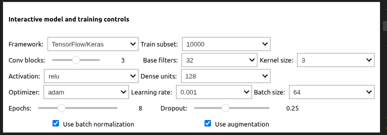
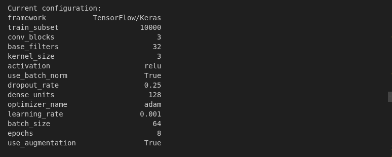
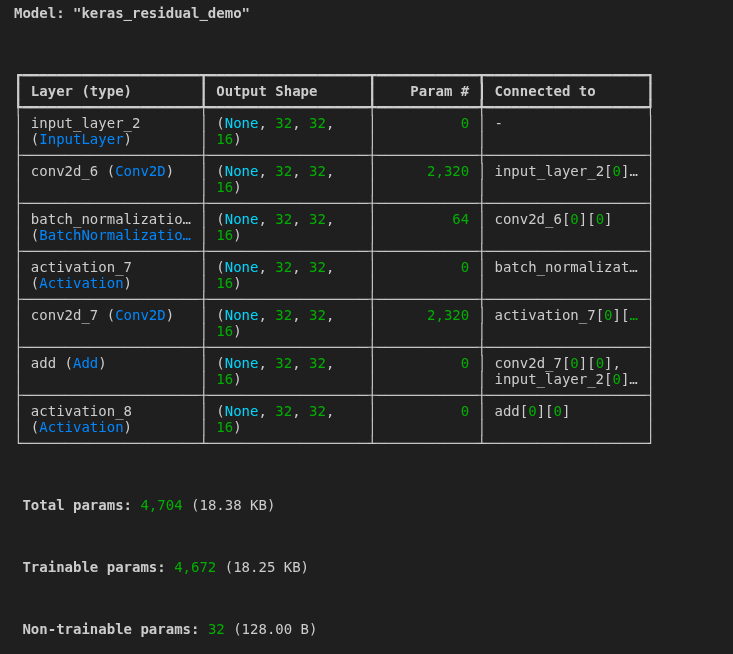
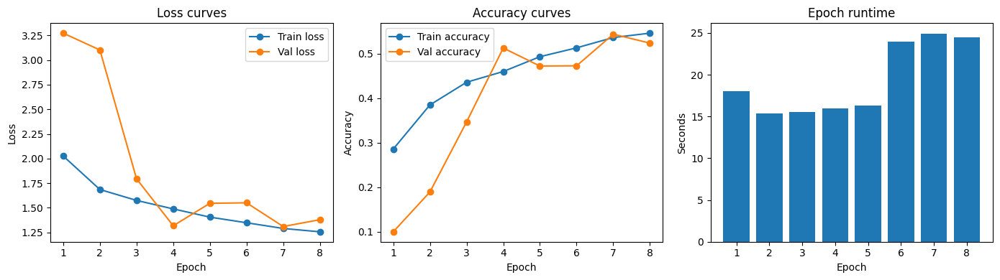
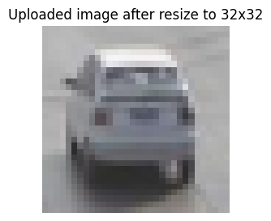
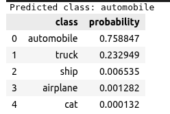

# Assignment 3.2: Part 2 - Advanced Tutorial Exploration & Reflection

**Group Members:**
* Ahammad, Jony
* Kumara, Muditha
* Podkorytov, Nikolai
* Shrestha Bata, Prabesh

---

## 1. What You Learned
This notebook focuses on building more realistic deep learning models, specifically moving into Computer Vision using Convolutional Neural Networks (CNNs). We learned how architecture design—such as the number of filters and layers—directly impacts a model's ability to extract complex features from images. Additionally, the tutorial demonstrated how experimentation with training time and parameter tuning is essential for optimizing performance.

---

## 2. Key Concepts
| Concept | Description | Impact on Training |
| :--- | :--- | :--- |
| **Convolution Layers** | Filters that slide over images to extract spatial features. | Helps the model recognize patterns like edges, textures, and shapes. |
| **Pooling Layers** | Down-samples the data to reduce dimensionality. | Reduces computational load and helps prevent overfitting. |
| **Batch Normalization** | Normalizes the inputs of each layer. | Speeds up training and provides stability by reducing internal covariate shift. |
| **Model Depth** | The total number of layers in the network. | Deeper models can learn more complex abstractions but are harder to train. |
| **Optimizer** | Algorithms like Adam or SGD that update weights. | Determines how quickly and smoothly the model reaches the minimum loss. |

---

## 3. Parameter Exploration

### Default Parameters

1. **Parameter Changed:** [e.g., Dropout Rate from 0.2 to 0.5]
   * **What happened:** [e.g., Validation accuracy increased, but training took longer.]
   * **What I learned:** High dropout helps with generalization on small datasets.
2. **Parameter Changed:** [e.g., Optimizer from SGD to Adam]
   * **What happened:** [e.g., Convergence was much faster with Adam.]
   * **What I learned:** Adaptive learning rate optimizers are often more efficient for CNNs.

---

## 4. TensorFlow/Keras vs. PyTorch
Based on the tutorial comparisons, we noticed three primary differences:
1. **Training Loop Structure:** Keras uses a highly abstracted `.fit()` method, whereas PyTorch requires a manual loop for the forward pass, loss calculation, and backpropagation.
2. **Ease of Use:** Keras is more beginner-friendly for building standard architectures quickly, while PyTorch offers more granular control for custom layer logic.
3. **Model-Building Style:** Keras often uses the `Sequential` class, whereas PyTorch typically defines models as classes inheriting from `nn.Module`.

---

## 5. Screenshots and Observations

* **Architecture Summary:** 

* **Training Curves:** 
* **Predictions:** [PRINT SCREEN NEEDED - Shows the model's output on test images]

---

## 6. Test on a New Image
* **Image Used:** 

* **Prediction:** 

* **Result:** 

* **Observation:** First upload high resolution image with multiple cars. Then the prediction is wrong. But the model respond well with low resolution image well.

---

## 7. Additional Research

* **Source 1: [Modern CNN Architectures: VGG and ResNet](http://d2l.ai/chapter_convolutional-modern/vgg.html)** * **Summary:** We explored the evolution from VGG, which popularized the use of simple, stacked $3 \times 3$ convolutions, to ResNet, which introduced "skip connections." ResNet’s residual learning effectively solves the vanishing gradient problem, allowing for much deeper networks (100+ layers) compared to the depth limitations of traditional VGG architectures.

* **Source 2: [Batch Normalization and Optimization Landscape](http://papers.neurips.cc/paper/7515-how-does-batch-normalization-help-optimization.pdf)** * **Summary:** Research shows that Batch Normalization (BN) significantly improves performance not just by reducing internal covariate shift, but by making the optimization landscape smoother. This interaction allows for more stable gradients, enabling the use of much higher learning rates and making optimizers like Adam and SGD converge significantly faster and with less sensitivity to weight initialization.

---

## 8. Individual Reflections

### Muditha Kumara
"The notebook provided a very clear and understandable framework for building complex models. It extremely user-friendly and can conducting multiple research comparisons. One technical challenge I noted was that **Leaky ReLU** is not implemented by default in all standard layer definitions. So it have to requiring manual adjustment. The lap top GPU is old and do not support CUDA. So consume too much time to train the modal. For future work, I believe it is necessary to perform further testing with various **learning rates** across different types of datasets to see where the frameworks truly diverge in performance."

### [Other Member Name]
"..."

### [Other Member Name]
"..."