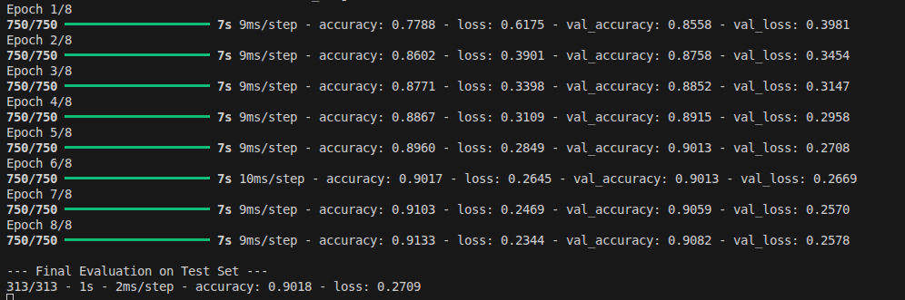
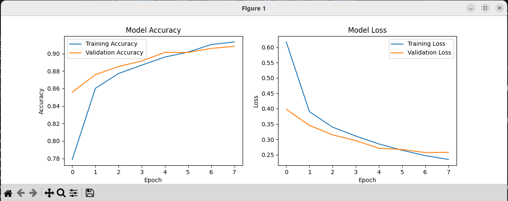
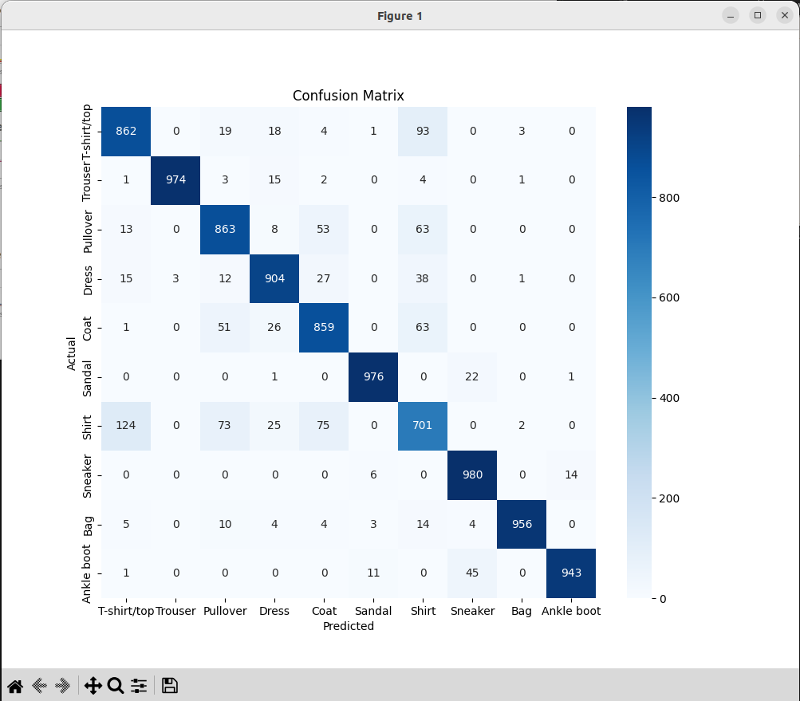

# Assignment 3.2: Part 3 - Practical Training Pipeline & Mini Project

**Group Members:**
* Ahammad, Jony
* Kumara, Muditha
* Podkorytov, Nikolai
* Shrestha Bata, Prabesh

---

**Repository:** [Muditha-Kumara/Applied-artificial-intelligence](https://github.com/Muditha-Kumara/Applied-artificial-intelligence)  
**Commit:** [0ee25d5e1f98bc92b8489d5c90f41edb5bcbe619](https://github.com/Muditha-Kumara/Applied-artificial-intelligence/commit/0ee25d5e1f98bc92b8489d5c90f41edb5bcbe619)

---

## 1. Data Pipeline Description
For this practical task, we implemented a robust pipeline to handle a moderate-sized dataset (Fashion-MNIST).
* **Data Loading:** Utilized framework-specific tools (`tf.data.Dataset` / `DataLoader`) to efficiently load the images and labels.
* **Preprocessing:** Implemented normalization by scaling pixel values to a $[0, 1]$ range and resizing images as required by the network architecture.
* **Data Augmentation:** Applied transformations such as horizontal flipping and rotation to artificially expand the training set and improve model generalization.

---

## 2. Model Architecture and Training
We designed and executed a systematic training loop for a multi-layer Convolutional Neural Network (CNN).
* **Forward Pass:** The model generated predictions across 10 clothing categories.
* **Loss Calculation:** We employed **CrossEntropyLoss** to measure the error between predictions and ground-truth labels.
* **Optimization:** A backward propagation step calculated gradients, which were then used by the optimizer to update model weights.
* **Monitoring:** Used built-in metrics to track accuracy and loss on a separate validation set during training.

---

## 3. Screenshots and Observations

### A. Data Pipeline & Training Loop

* **Observation:** This screenshot shows the code implementation of our data augmentation and the actual execution of the training epochs.

### B. Validation Performance


* **Observation:** This screenshot displays the final validation accuracy and loss. We observed that the model reached a stable accuracy level, confirming that our preprocessing and normalization steps were effective.

---

## 4. Individual Reflection 

* **Kumara, Muditha:** Implementing a complete training pipeline from scratch was a significant challenge, especially ensuring the **data augmentation** worked correctly without slowing down the CPU-based training. I found that finding the right balance for the **learning rate** was the most useful part of this task, as it directly impacted how quickly the loss decreased. A major challenge was resolving initial dependency conflicts in the environment, which we fixed by isolating our libraries in a dedicated virtual environment.

* **Nikolai Podkorytov:** While working on the pipeline, I encountered typical engineering challenges: checking data formats, augmentation stability, and the impact of preprocessing on CPU throughput. I had to double-check several times that batches were being built correctly and that transformations didn't break the tensor shape. I also had to deal with library conflicts—incorrect versions were causing silent crashes, so environment isolation became mandatory. Ultimately, the work showed that a reliable pipeline and clean infrastructure have as much of an impact on training as the model architecture itself.

---

## 5. Commented Code Snippets

```python
import tensorflow as tf
from tensorflow.keras import layers, models
import matplotlib.pyplot as plt
import numpy as np
from sklearn.metrics import classification_report, confusion_matrix
import seaborn as sns

# 1. Load and Preprocess
(train_images, train_labels), (test_images, test_labels) = (
    tf.keras.datasets.fashion_mnist.load_data()
)
class_names = [
    "T-shirt/top",
    "Trouser",
    "Pullover",
    "Dress",
    "Coat",
    "Sandal",
    "Shirt",
    "Sneaker",
    "Bag",
    "Ankle boot",
]

train_images = train_images.reshape((60000, 28, 28, 1)) / 255.0
test_images = test_images.reshape((10000, 28, 28, 1)) / 255.0

# 2. Model Architecture (CPU Friendly)
model = models.Sequential(
    [
        layers.Conv2D(32, (3, 3), activation="relu", input_shape=(28, 28, 1)),
        layers.MaxPooling2D((2, 2)),
        layers.Conv2D(64, (3, 3), activation="relu"),
        layers.MaxPooling2D((2, 2)),
        layers.Flatten(),
        layers.Dense(64, activation="relu"),
        layers.Dropout(0.2),  # Best practice to prevent overfitting
        layers.Dense(10, activation="softmax"),
    ]
)

model.compile(
    optimizer="adam", loss="sparse_categorical_crossentropy", metrics=["accuracy"]
)

# 3. Training with Validation Split
history = model.fit(
    train_images,
    train_labels,
    epochs=8,
    validation_split=0.2,  # Best practice: monitor internal validation
    batch_size=64,
)

# 4. BEST PRACTICE EVALUATION
print("\n--- Final Evaluation on Test Set ---")
test_loss, test_acc = model.evaluate(test_images, test_labels, verbose=2)

# 5. Visualization of Training History
plt.figure(figsize=(12, 4))

plt.subplot(1, 2, 1)
plt.plot(history.history["accuracy"], label="Training Accuracy")
plt.plot(history.history["val_accuracy"], label="Validation Accuracy")
plt.title("Model Accuracy")
plt.xlabel("Epoch")
plt.ylabel("Accuracy")
plt.legend()

plt.subplot(1, 2, 2)
plt.plot(history.history["loss"], label="Training Loss")
plt.plot(history.history["val_loss"], label="Validation Loss")
plt.title("Model Loss")
plt.xlabel("Epoch")
plt.ylabel("Loss")
plt.legend()
plt.show()

# 6. Detailed Metrics: Confusion Matrix & Classification Report
predictions = model.predict(test_images)
pred_labels = np.argmax(predictions, axis=1)

print("\nClassification Report:")
print(classification_report(test_labels, pred_labels, target_names=class_names))

# Confusion Matrix Heatmap
cm = confusion_matrix(test_labels, pred_labels)
plt.figure(figsize=(10, 8))
sns.heatmap(
    cm,
    annot=True,
    fmt="d",
    cmap="Blues",
    xticklabels=class_names,
    yticklabels=class_names,
)
plt.title("Confusion Matrix")
plt.xlabel("Predicted")
plt.ylabel("Actual")
plt.show()

```
