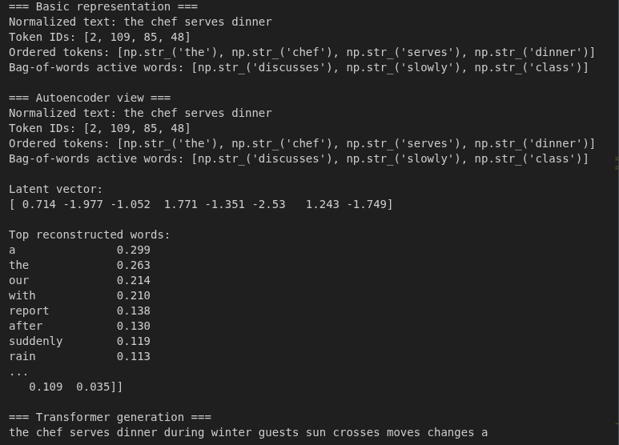
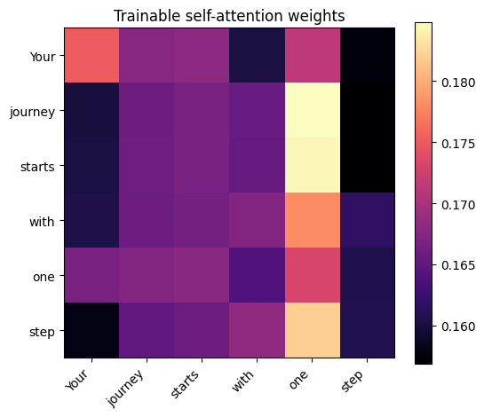

### **Assignment Report: Generative AI and LLM Exploration**

#### **1. Brief Summary of Exploration**
In this assignment, our group explored the evolution of generative models and the practical application of Large Language Models (LLMs) through three primary areas:

* **Generative Foundations**: We studied the progression from **Autoencoders (AEs)**, which focus on data compression and reconstruction, to **Variational Autoencoders (VAEs)** that allow for sampling from a smooth latent space. We also looked at **Generative Adversarial Networks (GANs)**, which use a "forger and inspector" analogy to improve output quality through competition.
* **Building LLMs from Scratch**: We examined the internal pipeline of a GPT-style model: **text → tokens → embeddings → attention → transformer blocks → next-token prediction**. We learned that modern LLMs are essentially decoder-only transformers trained for causal next-token prediction.
* **Prompt Engineering**: We transitioned from model architecture to model communication, learning how to steer pre-trained local models (like Qwen, Mistral, and SmolLM) using techniques such as **zero-shot**, **few-shot**, and **chain-of-thought** prompting.

---

#### **2. Selected Screenshots and Visualizations**

 Showing the visual comparison between the original input and the reconstructed output from the `generative_ai_text_autoencoders_vaes_gans_transformers_tutorial.ipynb` notebook.
 Include a visualization of the self-attention mechanism from the `llm_from_scratch_a_small_tutorial.ipynb` notebook to show how words "look" at each other.
* **[Insert Screenshot 3: Prompt Comparison]**: Show the output difference when using a weak prompt versus a structured prompt with persona and constraints in the `prompt_engineering_local_llms_tutorial_widgets.ipynb` notebook.

---

#### **3. Reflections and Key Insights**

* **Attention Mechanism insight**: A major insight was realizing that "attention" is not just a buzzword; it is a mathematical way for each token in a sentence to decide which other tokens are most relevant to its meaning. This directly solved the memory bottleneck issues faced by older RNN and LSTM models.
* **The Power of Latent Space**: Understanding that VAEs don't just store exact data points but rather "neighborhoods" (distributions) explains why they can generate new, realistic variations of data rather than just copies.
* **Prompting as Interface Design**: We realized that prompt engineering is less about "magic words" and more about **interface design**. Providing a clear role, task, and constraints (like a science journalist writing for a general audience) significantly improves model reliability.
* **Challenges**: One challenge was managing hardware limitations when running local models. We learned that choosing the right model size (e.g., using **SmolLM2-1.7B** for limited RAM) is a critical part of the engineering process.

---

#### **4. Group Members**
* Ahammad, Jony
* Kumara, Muditha
* Podkorytov, Nikolai
* Shrestha Bata, Prabesh
